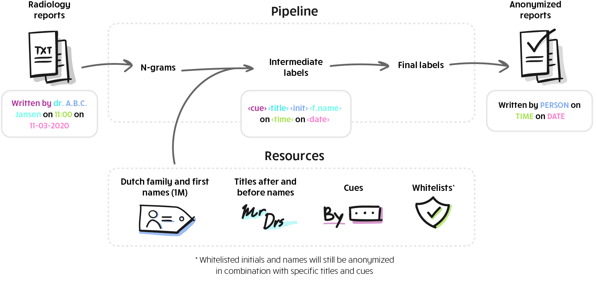
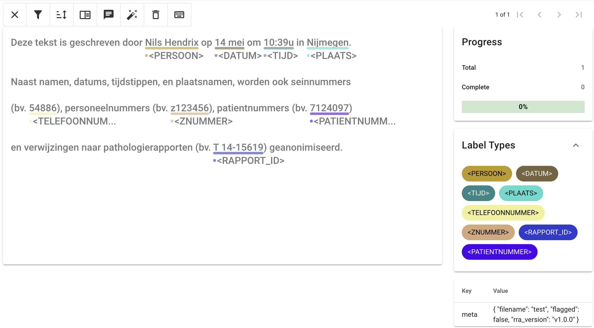

# radiology-report-anonymizer

**Radiology Report Anonymizer (RRA) V1.0.0**

### Introduction

Radiology Report Anonymizer (RRA) is a rule-based program written in Python that automatically removes privacy-sensitive information from Dutch radiology reports. This tool was developed by [Ward Hendrix](https://www.diagnijmegen.nl/people/ward-hendrix/) and [Nils Hendrix](https://www.diagnijmegen.nl/people/nils-hendrix/) during their PhD projects conducted within the Diagnostic Image Analysis Group (DIAG) at Radboudumc in the period 2019–2022. It was designed for (but is not limited to) anonymizing reports from the Radboud University Medical Center. The following entities are anonymized:

* Person names are replaced by `<PERSOON>`
* Dates and months are replaced by `<DATUM>`
* Times of day are replaced by `<TIJD>`
* Internal telephone numbers (including beeper numbers) are replaced by `<TELEFOONNUMMER>`
* Patient numbers are replaced by `<PATIENTNUMMER>`
* Personnel IDs and Z-numbers are replaced by `<ZNUMMER>` (specific to Radboudumc)
* Report IDs are replaced by `<RAPPORT_ID>` (e.g., T-number references to pathology reports, specific to Radboudumc)
* Dutch city names are replaced by `<PLAATS>` (if preceded by a preposition)

For more information, go to the [wiki page](https://github.com/DIAGNijmegen/radiology-report-anonymizer/wiki).

**IMPORTANT: There are currently no plans to maintain this tool beyond this initial release, and you may use it at your own risk. Always test the tool on the data from your institution and make adjustments to the configuration files if necessary. We will not provide active support for this repository, but you may open issues to inform or support others.**



*Overview of the radiology report anonymization pipeline.*

### How to use RRA

#### Installation

You can run this tool with a local Python installation or with [Docker](https://www.docker.com/). The tool has been tested with Python 3.10. If using a local Python installation, make sure to install the required packages by executing this terminal command from the root directory:

```bash
pip install --trusted-host pypi.python.org -r requirements.txt
```

If using Docker, you can build the Docker image with the `docker build` command:

```bash
docker build -t radiology_report_anonymizer:1.0.0 .
```

Or by executing the bash script `build.sh`:

```bash
bash build.sh
```

#### Anonymize reports

Run the following terminal command from the root directory (replace the placeholders within `<>`):

##### Local Python installation:

```bash
python -m model.anonymize_reports --input <path-to-input-dir-or-file> --output <path-to-output-dir-or-file> <additional-parameters-here>
```

##### Docker:

```bash
docker run --rm -v /$(pwd)/output:/output -v /$(pwd)/input:/input -u $(id -u) radiology_report_anonymizer:1.0.0 -m model.anonymize_reports --input <path-to-input-dir-or-file-in-container> --output <path-to-output-dir-or-file-in-container> <additional-parameters-here>
```

The volume bindings specified with `-v` will mount the directories `input` and `output` in your current working directory to the locations `/input` and `/output` in the Docker container. These locations are the default input and output paths for the program.

##### Parameters:

* `--input` (string): Path to (1) a directory with raw radiology reports (.txt) or (2) a JSON Lines file (.jsonl). Default: `/input`  
  In the JSON Lines file, each line corresponds to a separate report and contains a JSON object with the following fields:  
  - `text` (string): The report text to be anonymized.  
  - `meta` (nested dictionary): Key-value pairs of metadata tags corresponding to the report. In case a JSON Lines file is provided as input and if it contains the tag `StudyInstanceUID` or `filename`, this tag will be used as the report ID in the anonymized output (if both tags are present, then `StudyInstanceUID` will be selected). If these tags are not present, the line number in the JSON Lines file will be used as the report ID (starting from 0).
* `--output` (string): Destination path to (1) a directory for saving anonymized reports (.txt) or (2) a JSON Lines file (.jsonl). Flagged reports are exported to an "exceptions" subdirectory and need to be manually inspected (see the "Known issues" section). Default: `/output`
* `--flag-list` (list): Flag reports that contain one or more of the provided keywords (case-sensitive). The provided list must consist of strings, and it can be passed as a space-delimited list in the terminal (e.g., `--flag-list registratienr adres`). Default: `["registratiennr", "adres"]`
* `--dump-annotations` (boolean): Add this parameter (without value) to export text span annotations of detected privacy-sensitive data as a JSON Lines file instead of the anonymized reports. The JSON Lines file will be exported to the specified output location. The annotations can be loaded into the open-source annotation tool [Doccano](https://github.com/doccano/doccano) for inspection and, if necessary, correction. The (updated) annotations can then be used for exporting the anonymized reports (as explained in the next section).
* `--entities-to-anonymize` (list): List of entities to anonymize. The provided list must consist of strings, and it can be passed as a space-delimited list in the terminal (e.g., `--entities-to-anonymize person date time`). Default: `["person", "date", "time", "internal_phone_number", "patient_id", "z_number", "location", "report_id"]`

#### Export anonymized reports from annotations

Run the following terminal command from the root directory (replace the placeholders within `<>`):

##### Local Python installation:

```bash
python -m model.export_reports_from_annotations --input-annotations <path-to-annotation-file> --output-dir <path-to-output-dir>
```

##### Docker:

```bash
docker run --rm -v /$(pwd)/output:/output -v /$(pwd)/input:/input -u $(id -u) radiology_report_anonymizer:1.0.0 -m model.export_reports_from_annotations --input-annotations <path-to-annotation-file-in-container>
```

The volume bindings specified with `-v` will mount the directories `input` and `output` in your current working directory to the locations `/input` and `/output` in the Docker container. The output will be written to the `output` directory by default.

The annotations must be provided as a JSON Lines file (i.e., one valid JSON object per line) with the following format:

```json
{"text": "Voorbeeld van Hendrix, Ward.", "labels": [[14, 27, "<PERSOON>"]], "meta": {"filename": "test.txt"}}
```

The script exports all anonymized reports as TXT files in the specified output directory. We recommend creating and viewing annotations with the open-source annotation tool [Doccano](https://github.com/doccano/doccano).

##### Parameters:

* `--input-annotations` (string): Path to a JSON Lines file (.jsonl) with annotations.
* `--output-dir` (string): Output directory for saving anonymized reports (.txt). Default: `/output`



*The model output can be inspected and corrected with the annotation tool Doccano.*

#### Evaluate RRA

To test for breaking changes when modifying the codebase, run this terminal command from the root directory:

##### Local Python installation:

```bash
python -m pytest ./utils/check_model_integrity.py 
```

##### Docker:

```bash
docker run --rm radiology_report_anonymizer:1.0.0 -m pytest /app/utils/check_model_integrity.py 
```

If you have added new detection patterns to the program, make sure to update the `test_set_v1_0_0.csv` file under the `tests` directory. During testing, the tool loads a string from the test CSV file ("text" column) and compares the output of the program with the target string ("target" column). When the output string and target string do not match, this will be logged in the test report. In the report, the following error types are specified: 

1. The output string contains the correct token, but the string lengths do not match. 
2. The output string contains the wrong token.
3. The output string is not anonymized. 

In general, the following variables are stored per error case: case number / CSV row, error type, pattern, input string, output string, target string.

To evaluate performance on reports, run the following terminal command (replace the placeholders within `<>`):

##### Local Python installation:

```bash
python -m utils.validate_model --input-annotations <path-to-annotation-file> --ground-truth <path-to-ground-truth-annotation-file> --output-dir <path-to-output-dir>
```

##### Docker:

```bash
docker run --rm -v /$(pwd)/output:/output -v /$(pwd)/input:/input -u $(id -u) radiology_report_anonymizer:1.0.0 -m utils.validate_model --input-annotations <path-to-annotation-file-in-container> --ground-truth <path-to-ground-truth-annotation-file-in-container>
```

The volume bindings specified with `-v` will mount the directories `input` and `output` in your current working directory to the locations `/input` and `/output` in the Docker container. The output will be written to the `output` directory by default.

The annotations must be provided as a JSON Lines file in the format explained in the previous section. The script exports a test report with precision and recall scores, and text snippets of failure cases.

##### Parameters:

* `--input-annotations` (string): Path to a JSON Lines file (.jsonl) with annotations. This file can be generated using the `--dump_annotations` parameter when running the `anonymize_reports` script.
* `--ground-truth` (string): Path to a JSON Lines file (.jsonl) with ground truth annotations. This file should have the same structure as the input annotations.
* `--output-dir` (string): Output directory for saving the test report (.txt). Default: `/output`

### Troubleshooting

*The program prints “cannot access ‘build.sh’ permission denied”*  
If you are using Linux, open the terminal in the RRA directory and type `sudo chmod +x build.sh`. You only need to do this once.

*When validating the model from within the Docker container, pytest generates deprecation warnings regarding invalid escape sequences and generates pytest cache warnings regarding write permissions.*  
These warnings can be safely ignored as long as you don't modify the specified base image in the Docker file (the Python version must be 3.10).